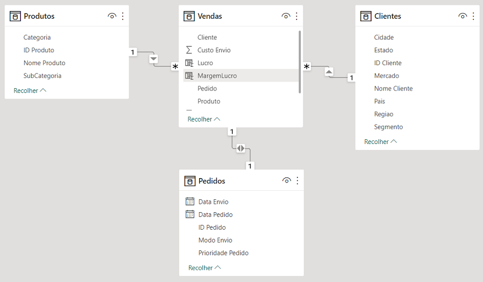
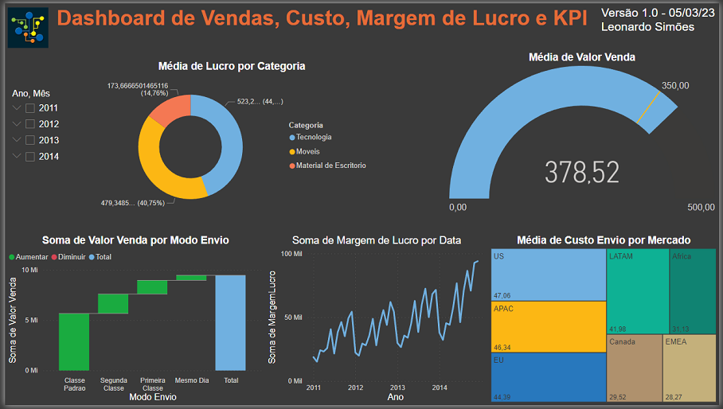
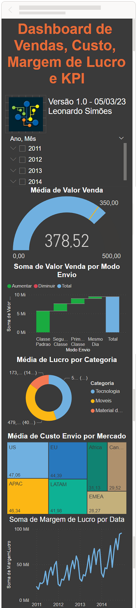

# Lab 2 - Dashboard de Vendas, Custo, Margem de Lucro e KPI

Atividade prática do Capítulo 3 do curso Microsoft Power BI Para Business Intelligence e Data Science 3.0 da Data Science Academy.

## Arquivos
- Lab2.pbix: arquivo do Power BI
- Lab2-Dashboard.png: print do dashboard
- Lab2-Dashboard-Mobile.png: print do dashboard mobile
- Lab2-Dataset.png: print da tabela do dataset
- Lab2-Relatorio.pdf: Documento pdf gerado pelo Power BI

## Formato dos dados

    

## Dashboard

    

## Dashboard Mobile

    

## Perguntas e Respostas

1. Qual foi o total de valor venda considerando cada modo de envio dos pedidos? Use um gráfico de cascata.
Classe Padrão = 5.669.989,20; Segunda Classe = 1.939.684,16; Primeira Classe = 1.366.779,74; Mesmo Dia = 499.826,10; Total = 9.476279,20.

2. Quais mercados tiveram o maior custo médio de envio dos produtos vendidos? Use um gráfico treemap.
US = 47,06; APAC = 46,34; EU = 44,39; LATAM = 41,98.

3. A empresa tem como objetivo (meta) manter uma média de 350 para o valor de venda todos os meses. Mostre um indicador (KPI–Key Performance Indicator ) com o valor médio de venda. A empresa ficou abaixo ou acima da meta no mês de Abril/2014?
Acima.

4. Considere que o lucro = valor venda - custo envio. Qual categoria de produto apresentou maior lucro médio?
Tecnologia.

5. Qual foi o comportamento da margem de lucro ao longo do tempo? Considere a margem de lucro como o lucro dividido pelo valor venda.
Se manteve com queda no mês de Fevereiro mas com tendência de crescimento, chegando até 94.009,05.

## Referências
Data Science Academy - Microsoft Power BI Para Business Intelligence e Data Science 3.0: https://www.datascienceacademy.com.br/course/microsoft-power-bi-para-data-science , acessado em 05/03/2023

