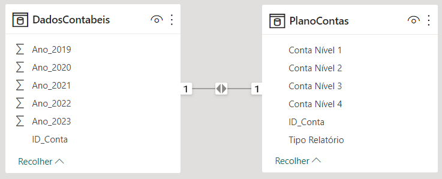
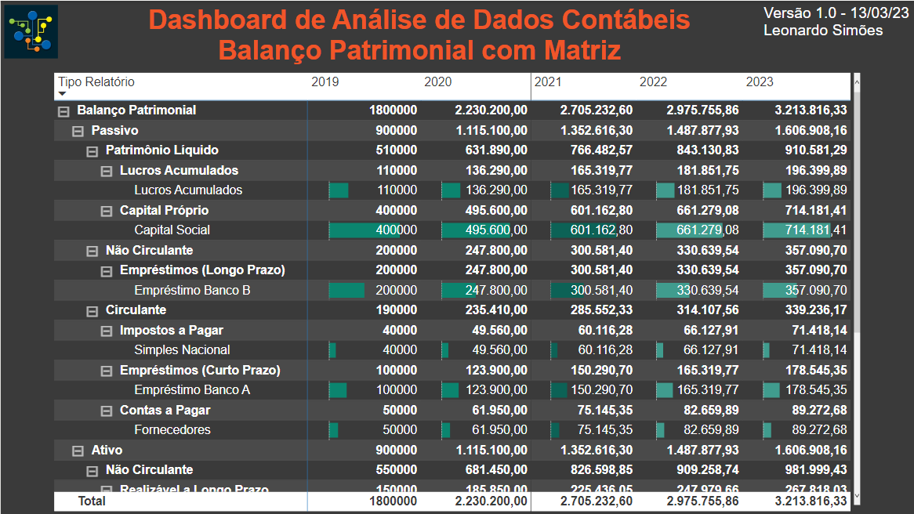

# Lab 3 - Análise de Dados Contábeis - Balanço Patrimonial
Atividade prática do Capítulo 9 do curso Microsoft Power BI Para Business Intelligence e Data Science 3.0 da Data Science Academy.

## Formato dos dados

    

## Dashboard

    

## Referências
Data Science Academy - Microsoft Power BI Para Business Intelligence e Data Science 3.0: https://www.datascienceacademy.com.br/course/microsoft-power-bi-para-data-science , acessado em 12/03/2023