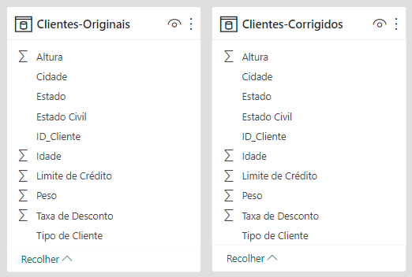
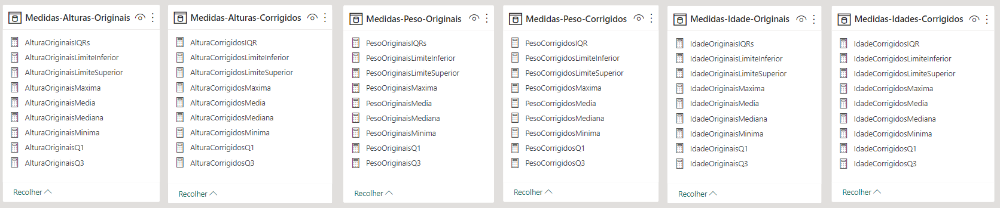
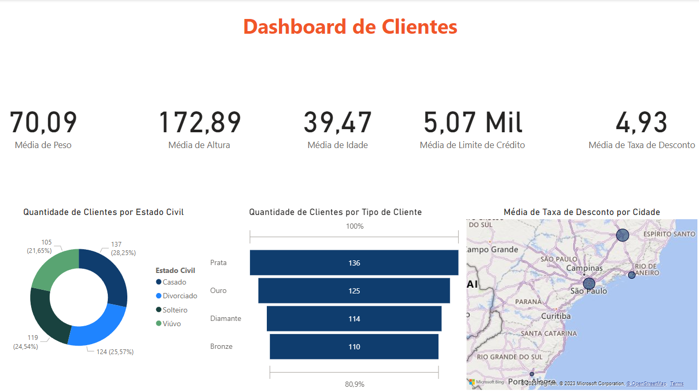

# Lab 4 - Limpeza e Manipulação de Dados de Cadastro de Clientes no Power BI
Atividade prática do Capítulo 12 do curso Microsoft Power BI 
Para Business Intelligence e Data Science 3.0 da Data Science Academy.

## Arquivos
- Lab4.pbix: arquivo do Power BI.
- Lab4-Dashboard.png: print do dashboard.
- Lab4-Contagem-Altura-270-278.png: print de contagem de valores 270 e 278 para Altura.
- Lab4-Contagem-Idade-NULL.png: print de contagem de valores null para Idade.
- Lab4-Contagem-ID-Clientes.png: print da contagem de valores repetidos para ID-Cliente.
- Lab4-Contagem-Peso-NULL.png: print de contagem de valores null para Peso.
- Lab4-Dataset.png: print das tabelas dos datasets original e corrigido.
- Lab4-Etapas-Aplicadas.png: print de etapas aplicadas no Power Query.
- Lab4-Medidas.png: print das tabelas de medidas.
- Lab4-Medidas-Criadas.txt: lista de comandos para criar as medidas.
- Lab4-Relatorio.pdf: Documento pdf gerado pelo Power BI.

## Formato dos dados

### Dataset

    

### Medidas

    

## Limpeza dos Dados

### Avaliação dos dados:
- Tabela de contagem de ID de formas total e distinta;
- Inspeção visual de valores;
- Verificação dos valores para Altura; 
- Tabela de contagem para valores null de Idade e Peso.

### Problemas encontrados:
- Valores duplicados de IDs;
- Altura maior ou igual a 270;
- Ausência de valores em Idade e Peso.

### Operações de Limpeza:
- As linhas com IDs duplicados foram removidas, mantendo apenas uma das ocorrências;
- As linhas com valores null em Idade e/ou Peso foram removidas;
- As linhas com valores de Altura maior ou igual a 270 foram removidas.

## Dashboard

    

## Referências
Data Science Academy - Microsoft Power BI Para Business Intelligence e Data Science 3.0: 
https://www.datascienceacademy.com.br/course/microsoft-power-bi-para-data-science , acessado em 03/04/2023

