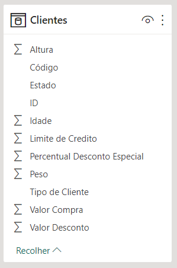
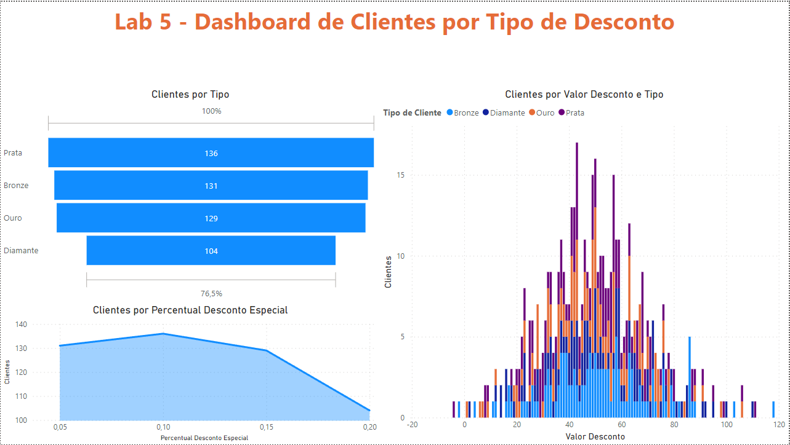

# Lab 5 - Engenharia de Atributos com Linguagem M no Power BI
Atividade prática do Capítulo 13 do curso Microsoft Power BI 
Para Business Intelligence e Data Science 3.0 da Data Science Academy.

## Arquivos
- Lab5.pbix: arquivo do Power BI.
- Lab5-Dashboard.png: print do dashboard.
- Lab5-Dataset.png: print da tabela do datasets modificado.
- Lab5-Relatorio.pdf: Documento pdf gerado pelo Power BI.
- Codigo-Linguagem-M-Power-Query.txt: Arquivo com o código de manipulação dos dados na linguagem M. 

## Formato dos dados

    

## Dashboard

    

## Referências
Data Science Academy - Microsoft Power BI Para Business Intelligence e Data Science 3.0: 
https://www.datascienceacademy.com.br/course/microsoft-power-bi-para-data-science , acessado em 14/04/2023