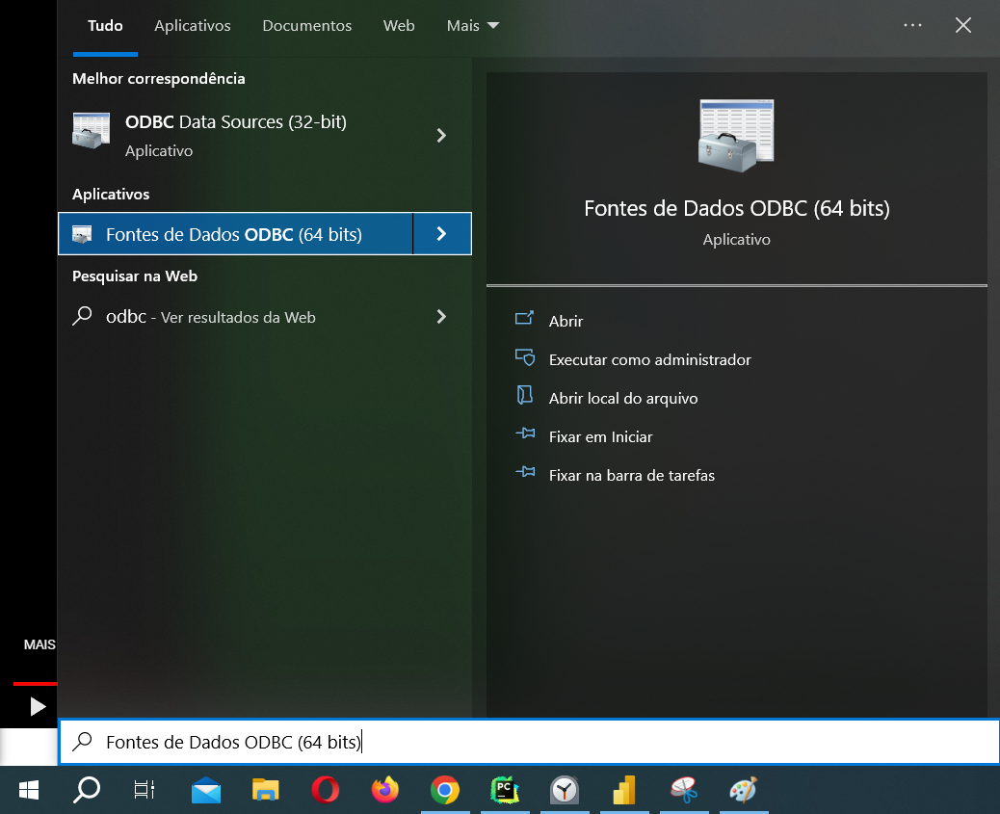
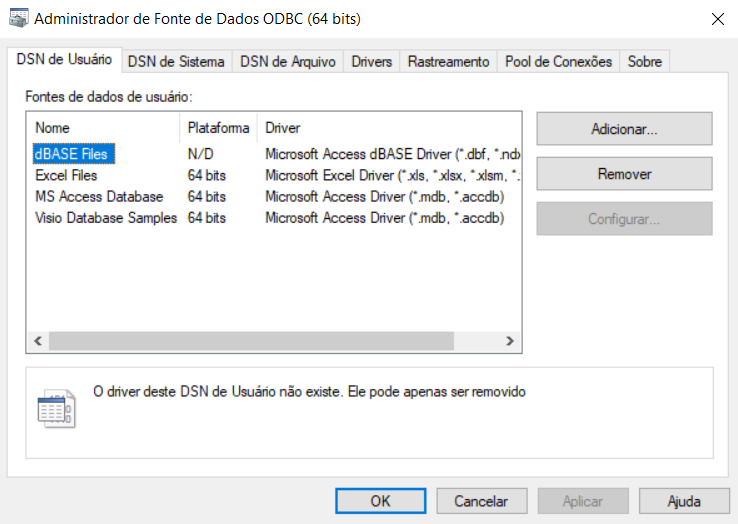
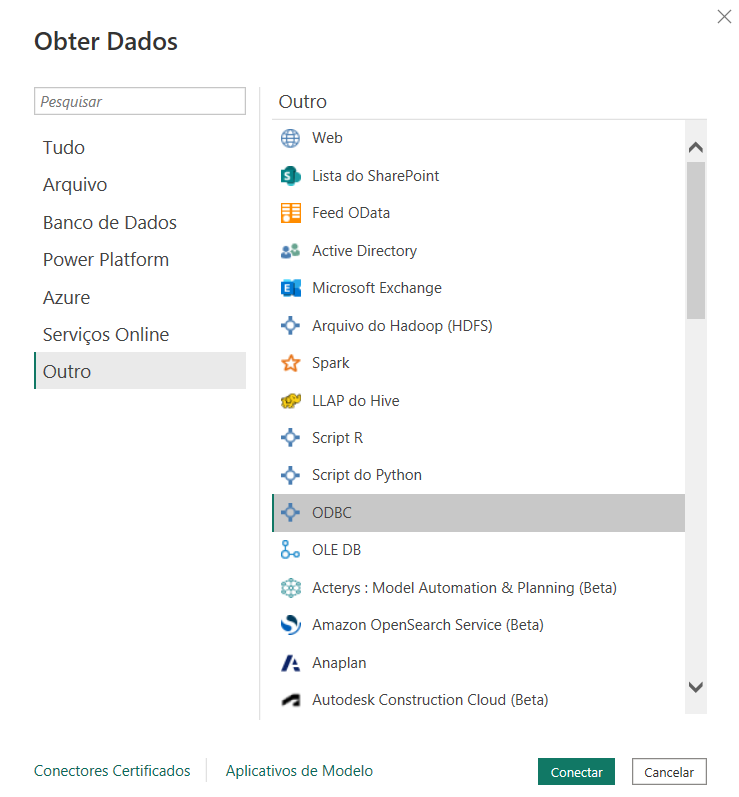
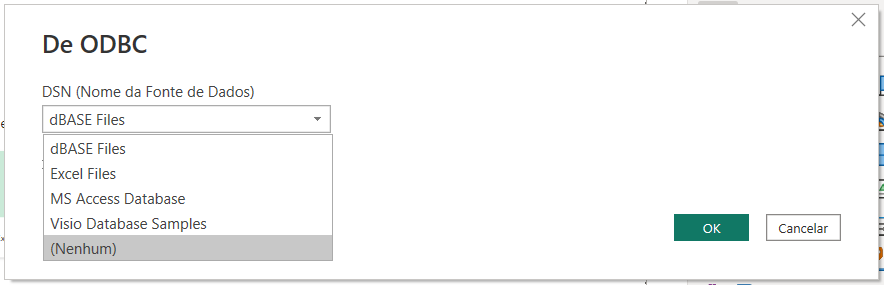

# Lab 6 - Trabalhando com Power BI e Banco de Dados Para Extração e Análise de Dados
Atividade prática do Capítulo 14 do curso Microsoft Power BI 
Para Business Intelligence e Data Science 3.0 da Data Science Academy.

O objetivo é configurar o Power BI para conectar em um banco de dados usando conexão ODBC. 

## Anotações
O Power BI oferece suporte nativo a vários bancos de dados, mas para alguns casos tem que instalar um conector.

O ODBC(Open Database Connectivity) é um conector "genérico" que usa drivers "específicos" para se conectar a SGBDs ou arquivos.

SQLite é o SGBD escolhido para o projeto. 
O Power BI não possui um conector específico para este, mas pode-se conectar usando ODBC.

1) No menu Iniciar do Windows, pesquise "ODBC" e clique em "Fontes de Dados ODBC (64 bits)".

    

2) Em "Fontes de Dados ODBC (64 bits)", verifique que não há um driver ODBC nativo do Windows para SQLite
e na aba "DNS de Usuário" clique em "Adicionar".

    

3) Baixe o driver do ODBC para SQLite em https://www.devart.com/odbc/sqlite/ e instale-o.
4) Abra novamente "Fontes de Dados ODBC (64 bits)", e na aba "DNS de Usuário", 
clique em "Adicionar" e verifique que o driver foi adcionado.
5) Selecione o novo driver e configure a conexão.
6) No Power BI, clique em "Obter dados", escolha "ODBC" em "Outros"
e se carregará todos os dados ou apenas uma parte deles a partir de uma consulta SQL.

    

    

## Referências
Data Science Academy - Microsoft Power BI Para Business Intelligence e Data Science 3.0: 
https://www.datascienceacademy.com.br/course/microsoft-power-bi-para-data-science , acessado em 15/08/2023.

Devart - ODBC - SQLite: https://www.devart.com/odbc/sqlite/ , acessado em 15/08/2023.