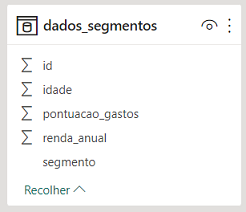
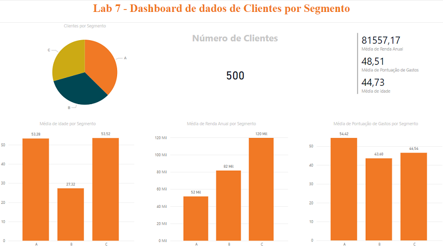

# Lab 7 - Machine Learning com Linguagem Python e Power BI Dentro do Jupyter Notebook
Atividade prática do Capítulo 16 do curso Microsoft Power BI 
Para Business Intelligence e Data Science 3.0 da Data Science Academy.

## Arquivos
- Lab7.ipynb: arquivo do Jupyter Notebook.
- Lab7.html: arquivo do Jupyter Notebook em formato html.
- Lab7.pbix: arquivo do Power BI.
- Lab7-Dashboard.png: print do dashboard.
- Lab7-Dataset.png: print da tabela do datasets modificado.
- Lab7-Logo.png: imagem do Projeto fornecida pela DSA.
- Lab7-Relatorio.pdf: documento pdf gerado pelo Power BI.

## Formato dos dados
Os dados fornecidos foram carregados no Jupyter Notebook, onde foi gerada um coluna segmento,
e então os dados foram salvos em um arquivo 'dados_segmentos.csv', 
e as coordenadas dos centróides de cada segmento foram salvos em um arquivo 'dados_centroides.csv'.

## Dashboard

## Referências
Data Science Academy - Microsoft Power BI Para Business Intelligence e Data Science 3.0: 
https://www.datascienceacademy.com.br/course/microsoft-power-bi-para-data-science , acessado em 01/05/2023.
