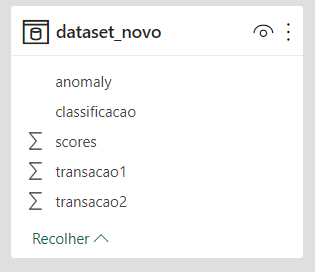
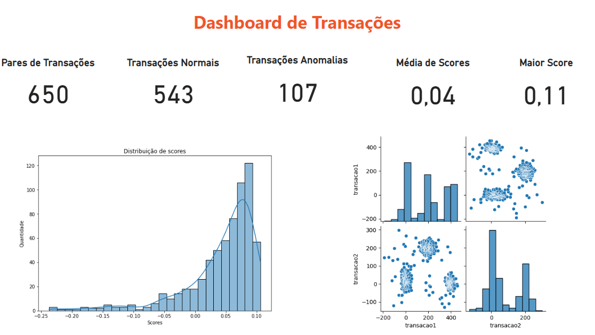
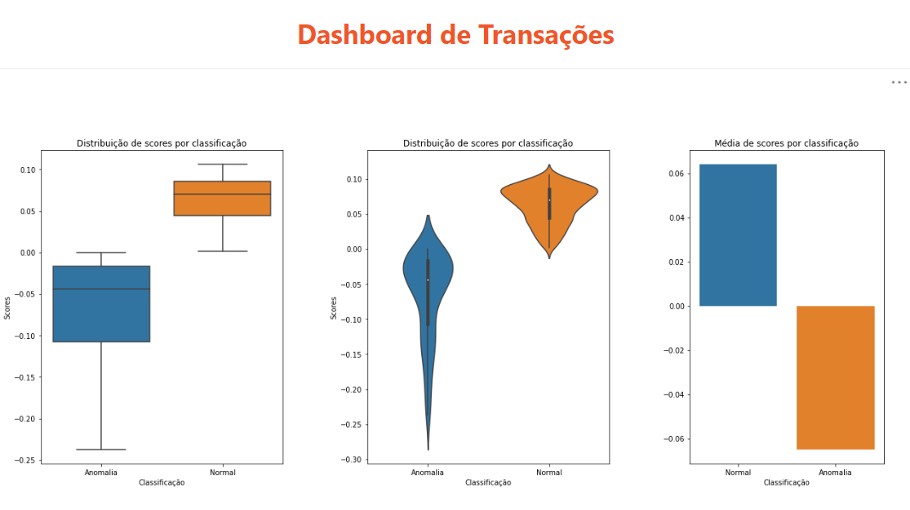

# Lab 8 - Detecção de Anomalias em Transações Financeiras com Linguagem Python e Power BI
Atividade prática do Capítulo 17 do curso Microsoft Power BI 
Para Business Intelligence e Data Science 3.0 da Data Science Academy.

## Arquivos
- Lab8.ipynb: arquivo do Jupyter Notebook.
- Lab8.html: arquivo do Jupyter Notebook em formato html.
- Lab8.pbix: arquivo do Power BI.
- Lab8-Dashboard1.png: print do dashboard 1.
- Lab8-Dashboard2.png: print do dashboard 2.
- Lab8-Dataset.png: print da tabela do datasets modificado.
- Lab8-Relatorio.pdf: documento pdf gerado pelo Power BI.

## Formato dos dados
Os dados fornecidos foram carregados no Jupyter Notebook, 
onde foram adicionadas coluna "anomaly", "scores" e "classificação",
de acordo com o modelo de IsolationForest criado.

## Dashboard

## Referências
Data Science Academy - Microsoft Power BI Para Business Intelligence e Data Science 3.0: 
https://www.datascienceacademy.com.br/course/microsoft-power-bi-para-data-science , acessado em 13/05/2023.