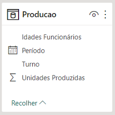
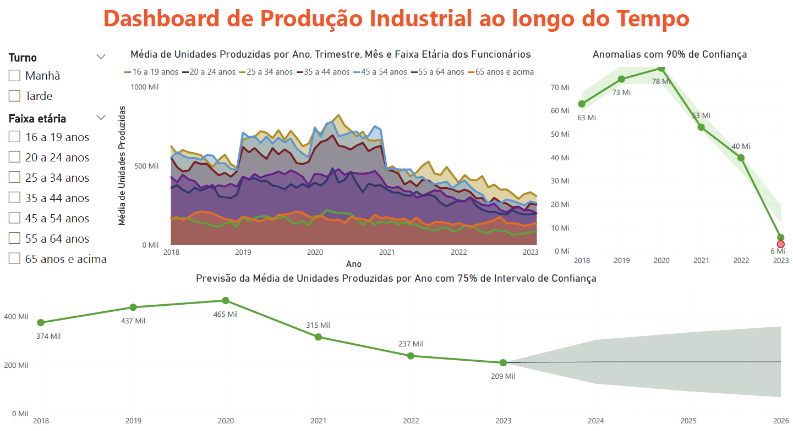

# Lab 9 - Engenharia de Producão com Power BI e IA Prevendo a Produção Industrial ao Longo do Tempo
Atividade prática do Capítulo 18 do curso Microsoft Power BI 
Para Business Intelligence e Data Science 3.0 da Data Science Academy.

## Arquivos
- Lab9.pbix: arquivo do Power BI.
- Lab9-Dashboard.png: print do dashboard.
- Lab9-Dataset.png: print da tabela do dataset.
- Lab9-Relatorio.pdf: documento pdf gerado pelo Power BI.

## Formato dos dados

## Dashboard

## Referências
Data Science Academy - Microsoft Power BI Para Business Intelligence e Data Science 3.0: 
https://www.datascienceacademy.com.br/course/microsoft-power-bi-para-data-science , acessado em 25/05/2023.