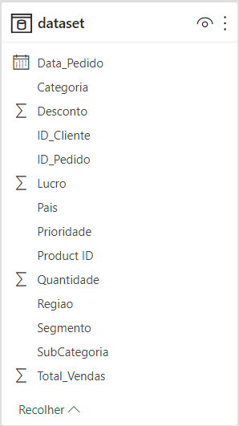
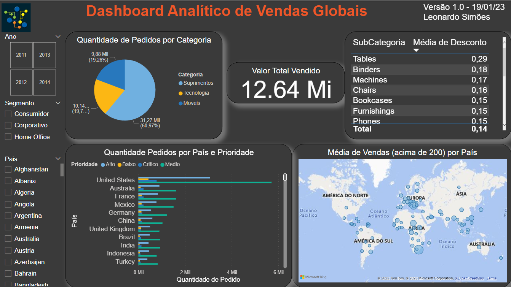
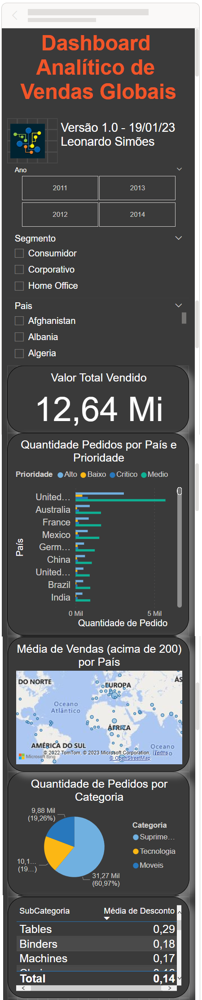

# Laboratório Prático 1 - Dashboard Analítico de Vendas Globais

Atividade prática do Capítulo 2 do curso Microsoft Power BI Para Business Intelligence e Data Science 3.0 da Data Science Academy.

## Arquivos
- LaboratorioPratico1.pbix: arquivo do Power BI
- LaboratorioPratico1-Dashboard.png: print do dashboard
- LaboratorioPratico1-Dashboard-Mobile.png: print do dashboard mobile
- LaboratorioPratico1-Dataset.png: print da tabela do dataset
- LaboratorioPratico1-Relatorio.pdf: Documento pdf gerado pelo Power BI

## Formato dos dados
Os dados são de vendas de uma empresa fictícia que comercializa produtos em todos os cantos do
mundo.

    

## Dashboard

    

## Dashboard Mobile

    

## Perguntas e Respostas
1. Qual o valor total vendido?
    12,64 milhões
    

2. Quantas vendas foram realizadas por categoria de produto?
Suprimentos: 31,27 milhões
Tecnologia: 10,14 milhões
Móveis: 9,88 milhões
    

3. Quantas vendas foram realizadas por país considerando a prioridade de entrega?
   No Brasil, a quantidade de vendas por prioridade foram 55 para Baixo, 936 para Médio, 486 para Alto e 122 para Crítico.
    

4. Qual foi a média de desconto nas vendas por subcategoria de produto?
A média geral foi de 14%.
    

5. Quais países tiveram maior média de valor de venda? (Demonstre em um mapa.)
Lesoto, Montenegro, Chade.

## Referências
Data Science Academy - Microsoft Power BI Para Business Intelligence e Data Science 3.0: https://www.datascienceacademy.com.br/course/microsoft-power-bi-para-data-science , acessado em 20/01/2023

