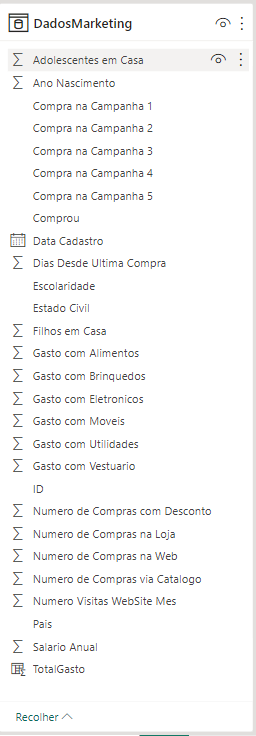
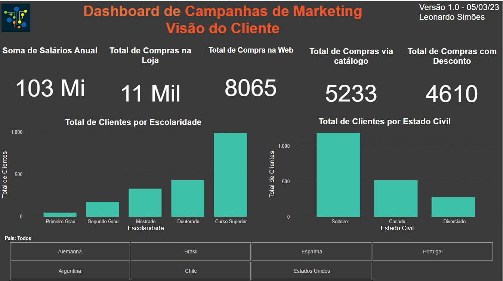
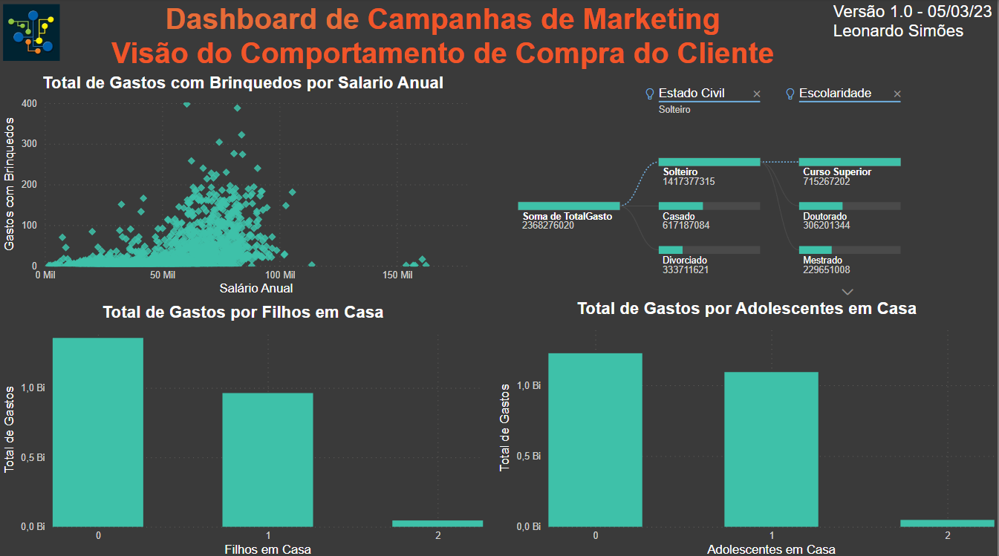
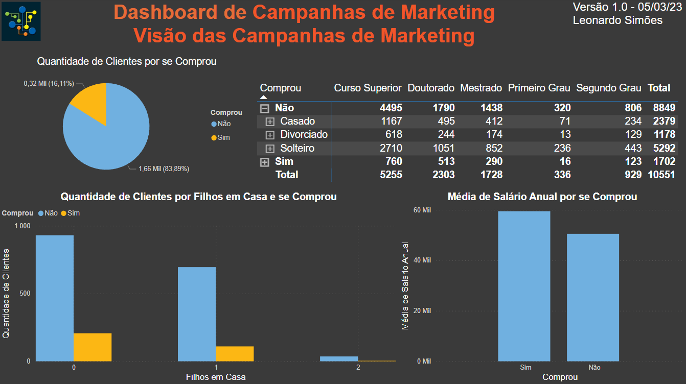
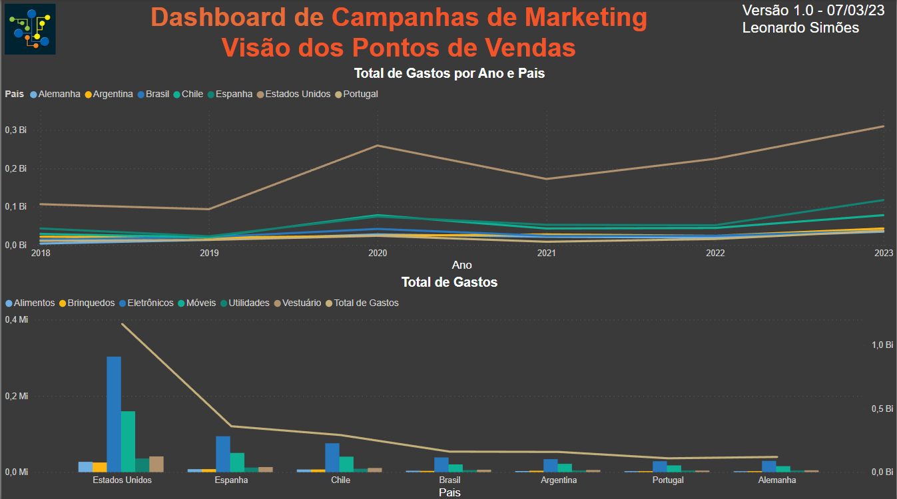
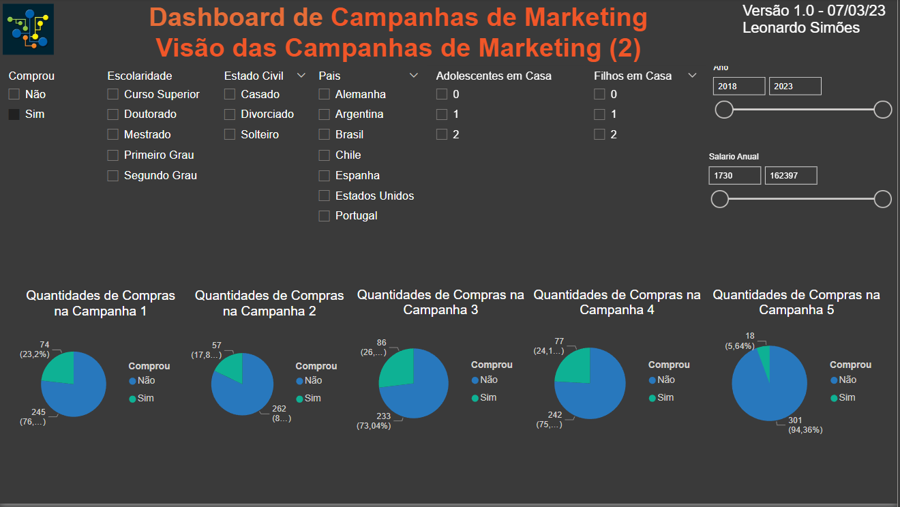

# Mini-Projeto 1 - Análise de Campanhas de Marketing com Power BI

Atividade prática do Capítulo 4 do curso Microsoft Power BI Para Business Intelligence e Data Science 3.0 da Data Science Academy.

## Arquivos
- MiniProjeto1.pbix: arquivo do Power BI
- MiniProjeto1-Dashboard1.PNG: print do dashboard - Visão do Cliente
- MiniProjeto1-Dashboard2.PNG: print do dashboard - Visão do Comportamento de Compra do Cliente
- MiniProjeto1-Dashboard3.PNG: print do dashboard - Visão das Campanhas de Marketing
- MiniProjeto1-Dashboard4.PNG: print do dashboard 4 - Visão dos Pontos de Vendas
- MiniProjeto1-Dashboard5.PNG: print do dashboard 5 - Visão das Campanhas de Marketing (2)
- MiniProjeto1-Dataset.PNG: print da tabela do dataset
- MiniProjeto1-Relatorio.pdf: Documento pdf gerado pelo Power BI

## Formato dos dados

    

## Dashboard 1 - Visão do Cliente

    

## Dashboard 2 - Visão do Comportamento de Compra do Cliente

    

## Dashboard 3 - Visão das Campanhas de Marketing

    

## Dashboard 4 - Visão dos Pontos de Vendas

    

## Dashboard 5 - Visão das Campanhas de Marketing (2)

    

