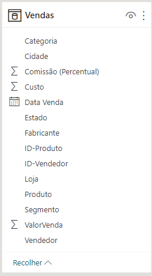
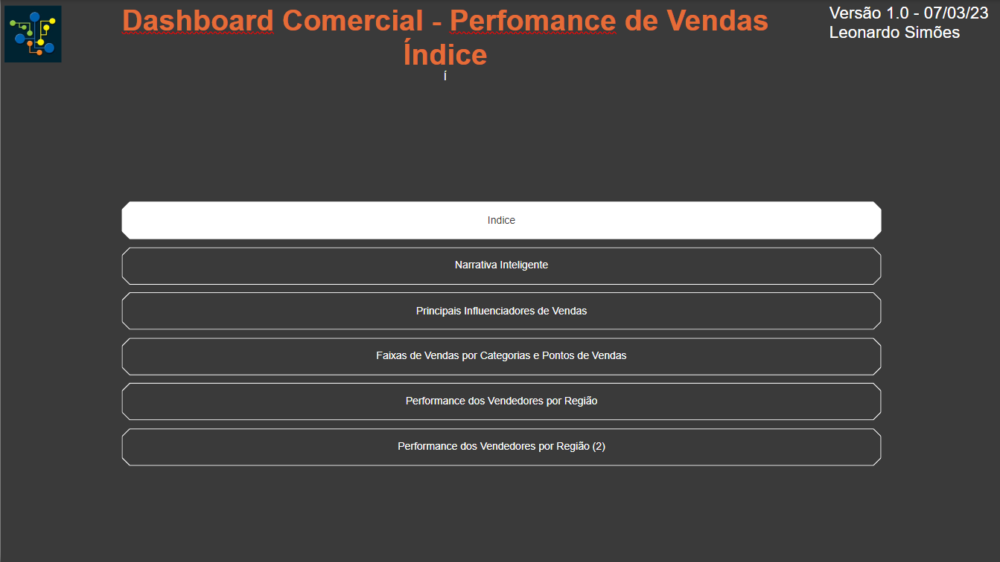
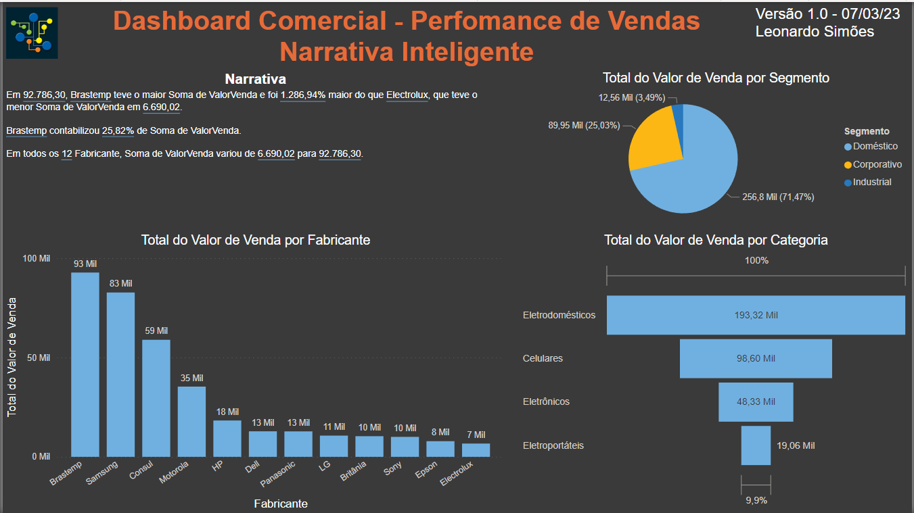
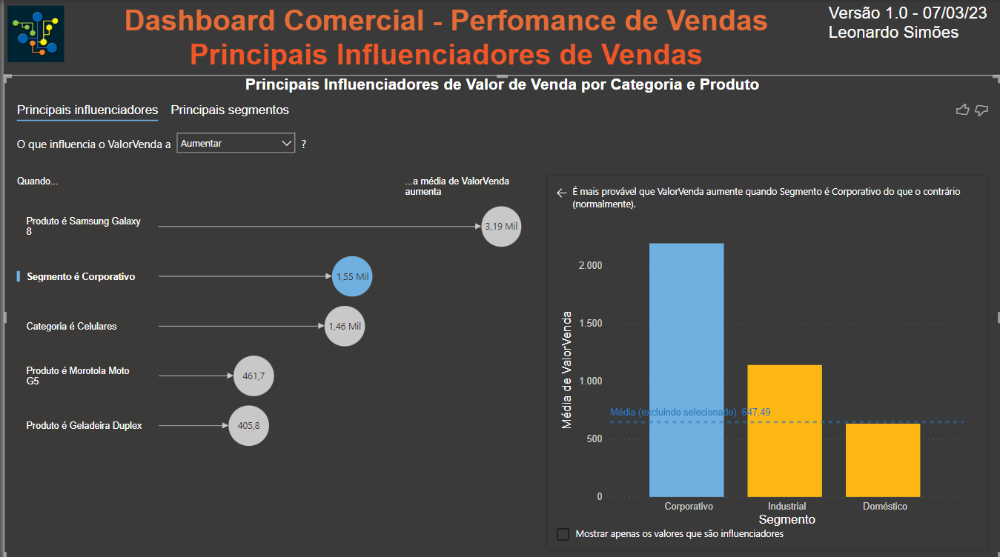
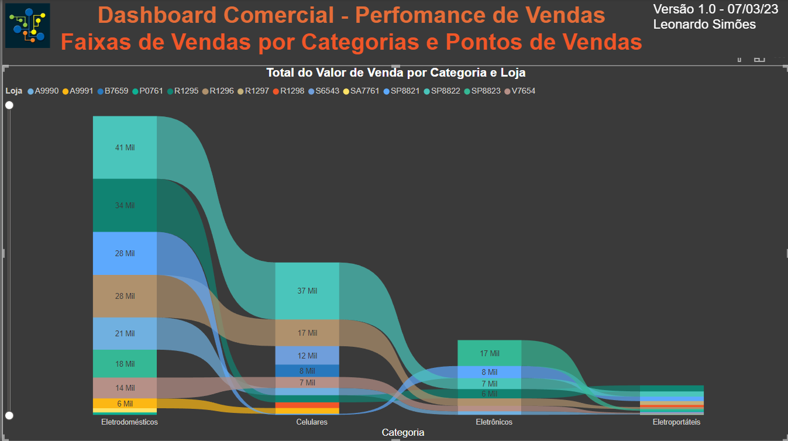
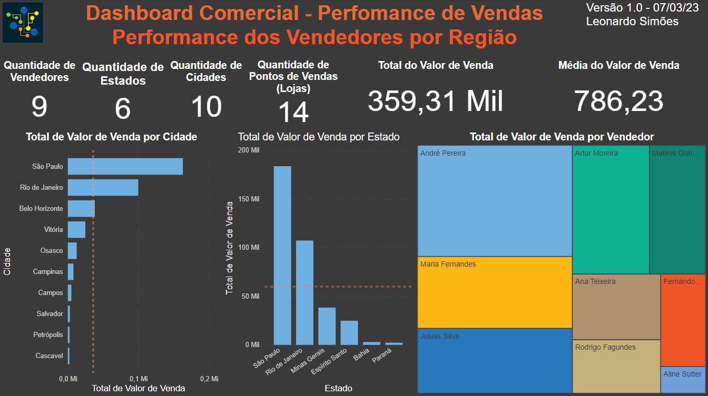
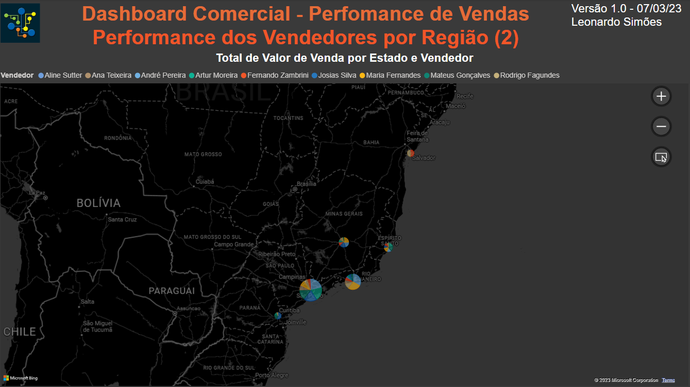

# Mini-Projeto 2 - Dashboard Comercial - Perfomance de Vendas

Atividade prática do Capítulo 5 do curso Microsoft Power BI Para Business Intelligence e Data Science 3.0 da Data Science Academy.

## Arquivos
- MiniProjeto2.pbix: arquivo do Power BI
- MiniProjeto2-Dashboard1.PNG: print do dashboard 1 - Narrativa Inteligente
- MiniProjeto2-Dashboard2.PNG: print do dashboard 2 - Principais Influenciadores de Vendas
- MiniProjeto2-Dashboard3.PNG: print do dashboard 3 - Faixas de Vendas por Categorias e Pontos de Vendas
- MiniProjeto2-Dashboard4.PNG: print do dashboard 4 - Performance dos Vendedores por Região
- MiniProjeto2-Dashboard5.PNG: print do dashboard 5 - Performance dos Vendedores por Região (2)
- MiniProjeto2-Dataset.PNG: print da tabela do dataset
- MiniProjeto2-Relatorio.pdf: Documento pdf gerado pelo Power BI

## Formato dos dados

    

## Índice de Dashboards

    

## Dashboard 1 - Narrativa Inteligente

    

## Dashboard 2 - Principais Influenciadores de Vendas 

    

## Dashboard 3 - Faixas de Vendas por Categorias e Pontos de Vendas

    

## Dashboard 4 - Performance dos Vendedores por Região

    

## Dashboard 5 - Performance dos Vendedores por Região (2)

    

## Referências
Data Science Academy - Microsoft Power BI Para Business Intelligence e Data Science 3.0: 
https://www.datascienceacademy.com.br/course/microsoft-power-bi-para-data-science , acessado em 10/06/2023.