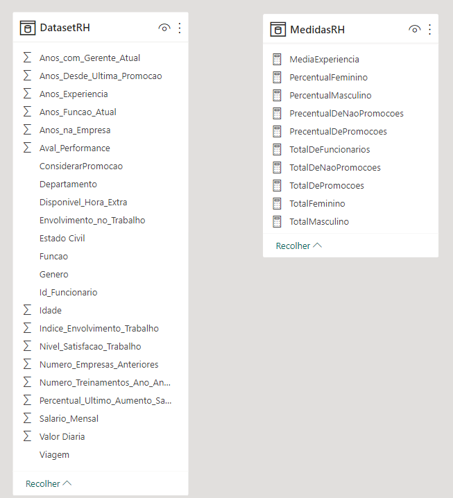
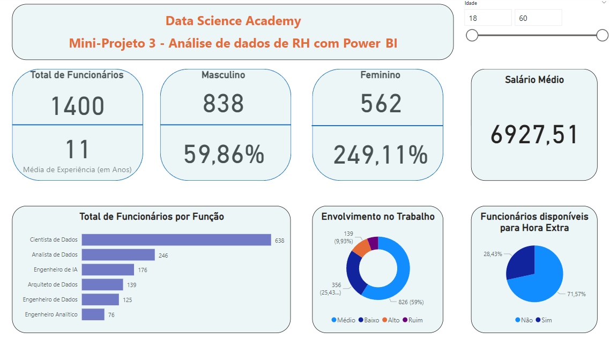

# Mini-Projeto 3 - Análise de dados de RH com Power BI

Atividade prática do Capítulo 6 do curso Microsoft Power BI Para Business Intelligence e Data Science 3.0 da Data Science Academy.

## Arquivos
- MiniProjeto3.pbix: arquivo do Power BI
- MiniProjeto3-Dashboard1.png: print do dashboard
- MiniProjeto3-Dataset.png: print da tabela do dataset
- MiniProjeto3-Relatorio.pdf: Documento pdf gerado pelo Power BI

## Formato dos dados

    

## Dashboard

    

## Perguntas e Respostas

1. Qual o total de funcionários atualmente na empresa? 1400.

2. Qual o tempo médio de experiência dos funcionários (em anos)? 11.

3. Qual o total e percentual de funcionários do gênero masculino e feminino? Masculino: 838 e 59,86 %; Feminino: 562 e 40,41%.

4. Qual a média salarial mensal? 6.927,51.

5. Qual o total de funcionários por função?

6. Qual o percentual de funcionários disponíveis para fazer hora extra? 28,43%

7. Qual o nível de envolvimento dos funcionários no trabalho considerando 4 categorias: Ruim, Baixo, Médio e Alto?

8. Este item não deve estar no Dashboard, mas precisa ser calculado: Qual o total e o percentual de funcionários que devem receber promoção? Considere a coluna “Anos Desde a última Promoção” com a seguinte regra: Se o funcionário tiver 5 anos ou mais desde a última promoção, deve ter a promoção considerada. Caso contrário, a promoção não deve ser considerada agora.
Funcionário que devem receber promoção: 247 (17,64 %).
Funcionário que não devem receber promoção: 1153 (82,36 %).

## Referências
Data Science Academy - Microsoft Power BI Para Business Intelligence e Data Science 3.0: https://www.datascienceacademy.com.br/course/microsoft-power-bi-para-data-science , acessado em 09/03/2023

