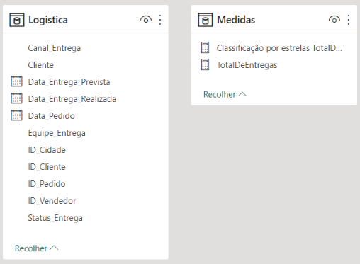
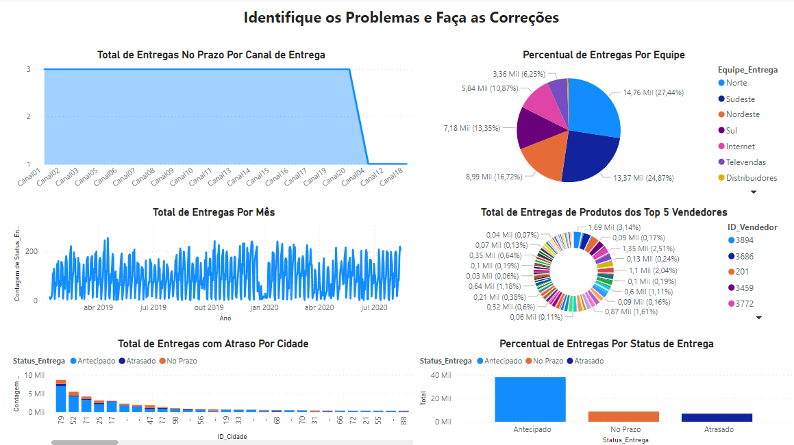
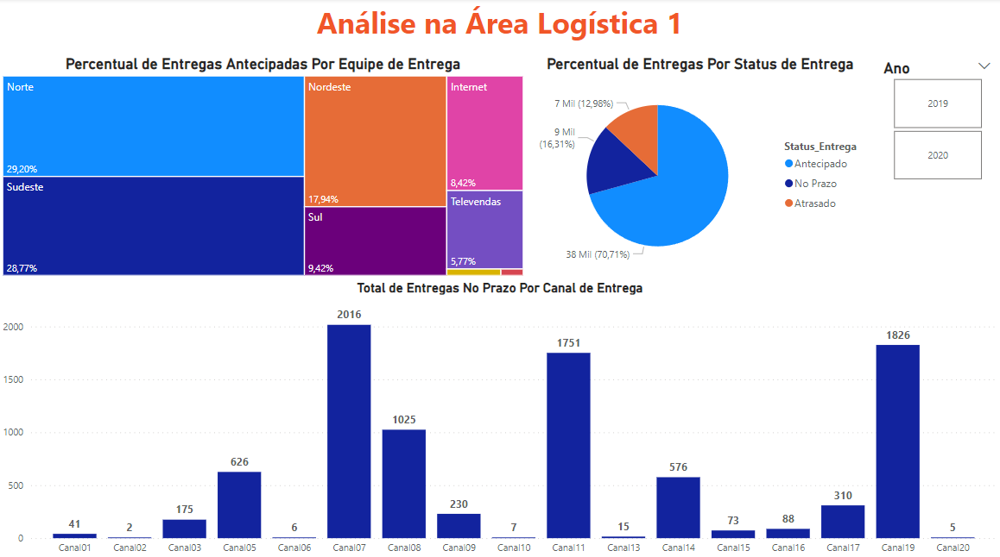
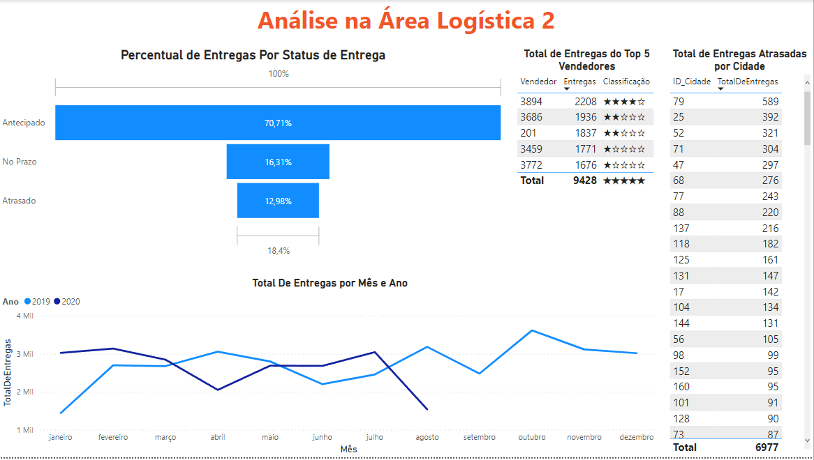
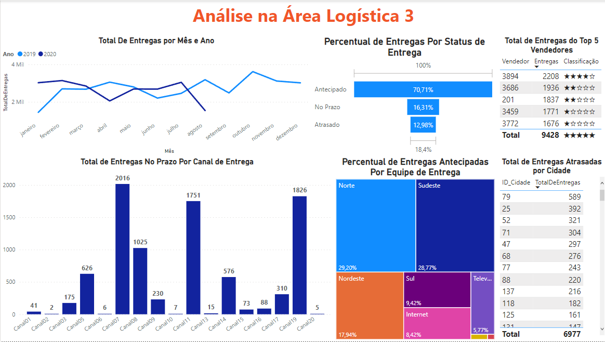

# Desconstruindo o Dashboard e Resolvendo Problemas de Análise na Área Logística

Atividade prática do Capítulo 7 do curso Microsoft Power BI Para Business Intelligence e Data Science 3.0 da Data Science Academy.

## Requisitos

O Dashboard precisava mostrar os seguintes KPIs de Logística:

1.  Total de Entregas no Prazo Por Canal de Entrega
2.  Percentual de Entregas Antecipadas Por Equipe de Entrega
3.  Total de Entregas Por Mês
4. Total de Entregas de Produtos dos Top 5 Vendedores
5. Total de Entregas com Atraso Por Cidade
6. Percentual de Entregas Por Status de Entrega

## Formato dos dados e medidas

    

## Dashboard fornecido com problemas

    

## Dashboards corrigidos
O dasboard foi dividido em 2 para facilitar a visualização.

    

    

### Dashboard Completo

    

## Referências
Data Science Academy - Microsoft Power BI Para Business Intelligence e Data Science 3.0: https://www.datascienceacademy.com.br/course/microsoft-power-bi-para-data-science , acessado em 11/03/2023

