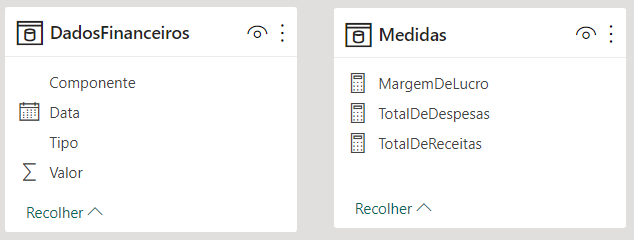
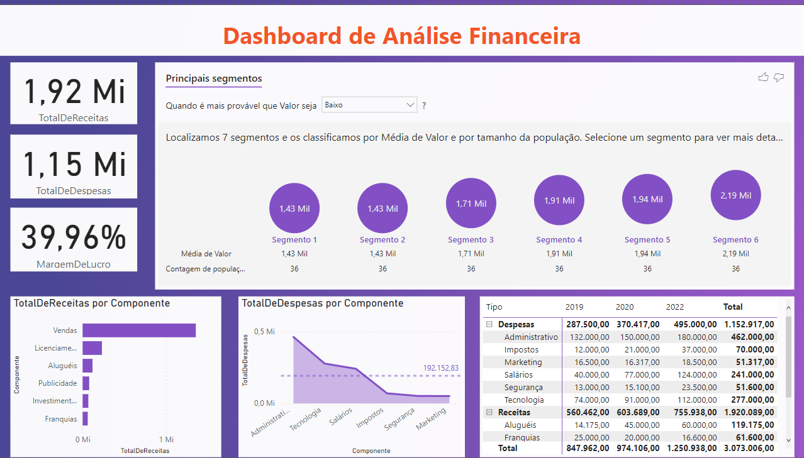

# Mini-Projeto 5 - Dashboard de Análise Financeira
Atividade prática do Capítulo 8 do curso Microsoft Power BI Para Business Intelligence e Data Science 3.0 da Data Science Academy.

## Arquivos
- MiniProjeto5.pbix: arquivo do Power BI.
- MiniProjeto5-Dashboard.png: print do dashboard.
- MiniProjeto5-Dataset.png: print da tabela do dataset e da tabela de medidas.
- MiniProjeto5-Relatorio.pdf: Documento pdf gerado pelo Power BI.

## Requisitos
Sua empresa deseja ter uma visão das receitas e despesas e solicitou que você criasse um Dashboard que permita analisar os seguintes indicadores financeiros:

1. Total de Receitas.

2. Total de Despesas.

3. Margem de Lucro.

4. Total de Receitas Por Componente.

5. Total de Despesas Por Componente em relação à média de Despesas.

6. Total de Receitas e Despesas Por Componente e Por Ano, com a hierarquia Tipo/Componente.

Além disso a empresa precisa identificar os segmentos onde Receitas e Despesas são maiores e menores a fim de traçar seu plano estratégico.

## Formato dos dados e medidas
Foi usado um pivoteamento de colunas e criada uma tabela para medidas.

    

## Dashboard

    

## Referências
Data Science Academy - Microsoft Power BI Para Business Intelligence e Data Science 3.0: 
https://www.datascienceacademy.com.br/course/microsoft-power-bi-para-data-science , acessado em 10/06/2023.