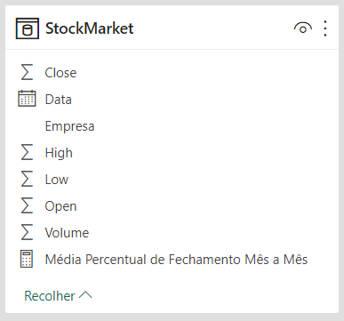
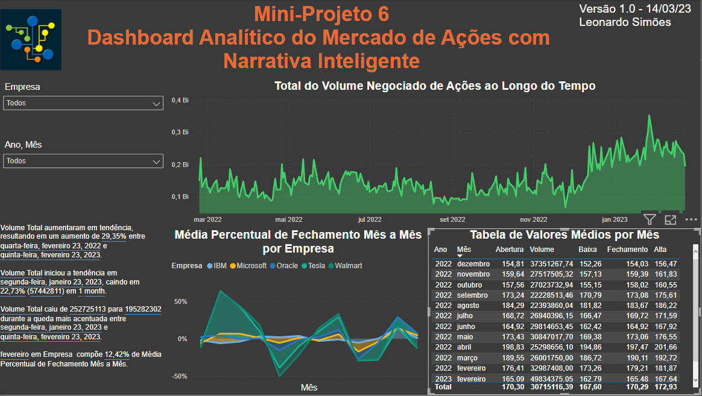

# Mini-Projeto 6 - Dashboard Analítico do Mercado de Ações com Narrativa Inteligente
Atividade prática do Capítulo 10 do curso Microsoft Power BI Para Business Intelligence e Data Science 3.0 da Data Science Academy.

## Arquivos
- MiniProjeto6.pbix: arquivo do Power BI.
- MiniProjeto6-Dashboard.png: print do dashboard.
- MiniProjeto6-Dataset.png: print da tabela do dataset e da tabela de medidas.
- MiniProjeto6-Relatorio.pdf: Documento pdf gerado pelo Power BI.

## Requisitos
O Dashboard deverá responder a estas perguntas de negócio abaixo:

1. Qual o total de volume negociado de ações ao longo do tempo para as 5 empresas que estão sendo analisadas? Permita que essa análise seja feita para uma única empresa ou combinação de empresas.

2. Qual o valor médio de abertura (Open), mais alto (High), mais baixo (Low) e de fechamento (Close) das ações de todas as empresas para todos os meses do período de dados analisado (1 ano em nosso exemplo)? Mostre no formato de tabela e permita que essa análise seja feita para uma única empresa ou combinação de empresas.

3. Qual a variação da média do valor de fechamento (close) das ações de todas as empresas ao longo do tempo, mês a mês? Permita que essa análise seja feita para uma única empresa ou combinação de empresas.

4. Use a Narrativa Inteligente para explicar as principais características e tendências nos dados.

5. O Dashboard deve ser formatado. 

## Formato dos dados
Os dados foram extraídos do site da Nasdaq e filtrados pela Data Science Academy.

    

## Dashboard

    

## Referências
Data Science Academy - Microsoft Power BI Para Business Intelligence e Data Science 3.0: https://www.datascienceacademy.com.br/course/microsoft-power-bi-para-data-science , acessado em 14/03/2023.

Nasdaq: https://www.nasdaq.com/ , acessado em 14/03/2023.